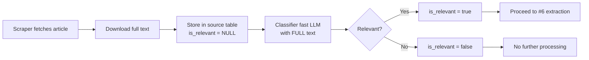

Modify the scraper to **always store the full text** of every article/report, then classify it for relevance to DDHH/DIH/VPS in Colombia or Palestine. This ensures no information is lost, and classification can be revisited later if criteria change.

**Why this is needed:**
- Initial tests (#6) generated pre‑alerts from irrelevant articles (cultural events, infrastructure, global news).
- No articles from key Colombian sources (Comisión Intereclesial, Conexión Putumayo) appeared in the first batch.
- Important information in long reports (e.g., Defensoría) may appear at the end — truncation would lose it.

**Core principle:** Store first, classify later. Full text is always saved. Classification happens after storage, using the complete text.

---

## Integration with Existing Issues

| Issue | Relation |
|-------|----------|
| **#4 / #9** (Scraper) | This modifies the scraper logic to store full text and classify after storage. |
| **#6** (LLM extraction) | Only articles classified as `is_relevant = true` proceed to JSON extraction. |
| **#2** (Source table) | The `source` table stores full text and classification results. |

---

## Data Flow



**Key principle:** Full text is always stored. Classification can be re‑run later if needed.

---

## Source Table Schema

Add classification columns (if not already present):

```sql
ALTER TABLE source ADD COLUMN is_relevant BOOLEAN DEFAULT NULL;
ALTER TABLE source ADD COLUMN classification_reason TEXT;
ALTER TABLE source ADD COLUMN raw_content TEXT;  -- optional, for full HTML

CREATE INDEX idx_source_is_relevant ON source(is_relevant);
```

---

## Implementation

### 1. Fast Classifier (Optional, Rule‑Based)

Create `lib/classifyByKeywords.ts`:

```typescript
// lib/classifyByKeywords.ts
export function classifyByKeywords(text: string, title: string): {
  relevant: boolean;
  confidence: 'high' | 'low';
  reason: string;
} {
  const violenceKeywords = [
    'asesinato', 'masacre', 'desplazamiento', 'amenaza', 'ejecución',
    'tortura', 'desaparición', 'violencia', 'conflicto', 'guerrilla',
    'paramilitar', 'frente', 'ataque', 'homicidio', 'secuestro',
    'despojo', 'reclutamiento', 'menor', 'lider social', 'defensor',
    'comunidad', 'indígena', 'campesino', 'organización', 'paz',
    'derechos humanos', 'DDHH', 'DIH', 'violación',
    'kill', 'murder', 'massacre', 'displacement', 'forced', 'settler',
    'occupation', 'detention', 'torture', 'human rights'
  ];

  const colombiaKeywords = [
    'Putumayo', 'Mocoa', 'Puerto Asís', 'Colombia', 'Cauca', 'Nariño',
    'Villagarzón', 'Orito', 'Sibundoy', 'zona de reserva campesina'
  ];

  const palestineKeywords = [
    'Palestine', 'Gaza', 'West Bank', 'Israel', 'occupied Palestinian',
    'Jerusalem', 'Ramallah', 'Hebron', 'Nablus', 'Jenin', 'Rafah'
  ];

  const textLower = text.toLowerCase();
  const titleLower = title.toLowerCase();

  const hasViolence = violenceKeywords.some(k => textLower.includes(k) || titleLower.includes(k));
  const hasColombia = colombiaKeywords.some(k => textLower.includes(k) || titleLower.includes(k));
  const hasPalestine = palestineKeywords.some(k => textLower.includes(k) || titleLower.includes(k));

  if (hasViolence && (hasColombia || hasPalestine)) {
    return {
      relevant: true,
      confidence: 'high',
      reason: `Violence + ${hasColombia ? 'Colombia' : 'Palestine'}`
    };
  }

  if (hasViolence && !hasColombia && !hasPalestine) {
    return {
      relevant: false,
      confidence: 'low',
      reason: 'Violence but outside Colombia/Palestine'
    };
  }

  return {
    relevant: false,
    confidence: 'high',
    reason: 'No violence or region keywords found'
  };
}
```

### 2. LLM Classifier (Full Text)

Create `lib/classifyNewsLLM.ts`:

```typescript
// lib/classifyNewsLLM.ts
import { callLLM } from './llmClient';

export async function classifyNewsLLM(
  text: string,   // ✅ full text, no truncation
  title: string
): Promise<{ relevant: boolean; reason: string }> {
  const prompt = `
Eres un clasificador de noticias para un sistema de documentación de violencia política en Colombia y Palestina.

**Tarea:** Lee TODO el texto y determina si describe un caso de:
- Violación de Derechos Humanos (DDHH)
- Infracción al Derecho Internacional Humanitario (DIH)
- Violencia Político-Social (VPS)

**Criterios de inclusión:**
- Asesinatos, desapariciones, tortura, ejecuciones extrajudiciales
- Desplazamiento forzado, masacres, amenazas a líderes sociales
- Ataques a comunidades, restricciones a la libertad de movimiento
- Conflictos armados, presencia de grupos armados ilegales
- Represión política, persecución a defensores de DDHH

**Región:** Colombia o Palestina.

**IMPORTANTE:** Lee el texto COMPLETO. La información relevante puede estar al final.

Noticia:
Título: ${title}
Texto: ${text}

Responde EXACTAMENTE en este formato:
RELEVANTE: [SÍ/NO]
RAZÓN: [Una frase breve]`;

  const response = await callLLM(prompt, { temperature: 0.1 });
  
  // Parse response
  const relevantMatch = response.match(/RELEVANTE:\s*(SÍ|NO)/i);
  const reasonMatch = response.match(/RAZÓN:\s*(.+)/i);

  const relevant = relevantMatch?.[1]?.toUpperCase() === 'SÍ';
  const reason = reasonMatch?.[1] || 'No se pudo determinar';

  return { relevant, reason };
}
```

### 3. Modified Scraper (Store First, Classify After)

Modify `scripts/scrape-news.ts`:

```typescript
// scripts/scrape-news.ts (modified)
import { classifyByKeywords } from '../lib/classifyByKeywords';
import { classifyNewsLLM } from '../lib/classifyNewsLLM';

async function processArticle(article: Article) {
  // 1. Download full text
  const fullText = await fetchFullArticle(article.url);
  const cleanText = cleanHTML(fullText);
  const contentHash = createHash('sha256').update(cleanText).digest('hex');

  // 2. Store in database (always, with is_relevant = NULL)
  const sourceId = await db
    .insertInto('source')
    .values({
      url: article.url,
      title: article.title,
      published_at: article.publishedAt,
      medium: article.medium,
      clean_text: cleanText,        // ✅ always stored
      content_hash: contentHash,
      is_relevant: null,            // ⬅️ pending classification
      raw_content: fullText         // optional
    })
    .returning('id')
    .executeTakeFirst();

  console.log(`📥 Stored: ${article.title} (ID: ${sourceId?.id})`);

  // 3. Classify (with full text)
  let classificationReason: string;
  let isRelevant: boolean;

  // 3a. Fast classifier (optional, to avoid LLM on obvious cases)
  const quickResult = classifyByKeywords(cleanText, article.title);

  if (quickResult.confidence === 'high' && quickResult.relevant === false) {
    // Clearly irrelevant – skip LLM
    isRelevant = false;
    classificationReason = quickResult.reason;
  } else {
    // Ambiguous or likely relevant – use LLM with FULL text
    const llmResult = await classifyNewsLLM(cleanText, article.title);
    isRelevant = llmResult.relevant;
    classificationReason = llmResult.reason;
  }

  // 4. Update classification
  await db
    .updateTable('source')
    .set({
      is_relevant: isRelevant,
      classification_reason: classificationReason
    })
    .where('id', '=', sourceId.id)
    .execute();

  if (isRelevant) {
    console.log(`✅ Relevant: ${article.title}`);
  } else {
    console.log(`❌ Not relevant: ${article.title}`);
  }

  return { sourceId: sourceId.id, isRelevant };
}
```

### 4. Re‑classification Script (Optional)

Create `scripts/reclassify.ts` to re‑run classification on stored sources (useful if criteria change):

```typescript
// scripts/reclassify.ts
import { classifyNewsLLM } from '../lib/classifyNewsLLM';

async function reclassifySources() {
  const sources = await db
    .selectFrom('source')
    .select(['id', 'title', 'clean_text', 'is_relevant'])
    .where('is_relevant', 'is', null) // or 'is', 'not', null to reclassify all
    .limit(50)
    .execute();

  for (const source of sources) {
    const result = await classifyNewsLLM(source.clean_text, source.title);
    await db
      .updateTable('source')
      .set({
        is_relevant: result.relevant,
        classification_reason: result.reason
      })
      .where('id', '=', source.id)
      .execute();
    console.log(`Reclassified: ${source.title} → ${result.relevant ? 'SÍ' : 'NO'}`);
  }
}
```

---

## Priority Order for Sources

Modify `config/sources.json` to process Colombian sources first:

```json
[
  { "name": "Comisión Intereclesial", "priority": 1 },
  { "name": "Conexión Putumayo", "priority": 1 },
  { "name": "INDEPAZ", "priority": 1 },
  { "name": "Facebook Red DDHH Putumayo", "priority": 1 },
  { "name": "El Espectador", "priority": 2 },
  { "name": "MiPutumayo Noticias", "priority": 2 },
  { "name": "ReliefWeb", "priority": 3 },
  { "name": "HRW", "priority": 3 },
  { "name": "ONU-DH Colombia", "priority": 3 },
  { "name": "Resumen Latinoamericano", "priority": 4 },
  { "name": "CIDH", "priority": 4 },
  { "name": "Defensoría del Pueblo", "priority": 4 }
]
```

---

## Acceptance Criteria

- [ ] Scraper always stores full text (`clean_text`) in `source` table, regardless of relevance.
- [ ] Classification runs **after** storage, using the full text.
- [ ] Fast classifier (keywords) correctly identifies clearly irrelevant articles.
- [ ] LLM classifier correctly identifies ambiguous or relevant articles.
- [ ] `is_relevant` is updated to `true` or `false` for each article.
- [ ] At least one relevant article from Comisión Intereclesial or Conexión Putumayo is detected.
- [ ] Re‑classification script works (if needed).
- [ ] Logs clearly show: stored → classified → result.

---

## Dependencies

- Requires #4 / #9 (scraper) to be functional.
- Requires #6 (LLM client) to be available.
- Requires #2 (`source` table with `is_relevant` and `clean_text`).

---

## Related Issues

- Epic: [#36](https://github.com/pasosdeJesus/sivel3/issues/36)
- Predecessors: #4, #6, #9
- Related: #2 (source table)

---

## Notes for the Developer

- **No truncation:** The LLM classifier receives the **full** `clean_text`. No limits.
- **Fast classifier:** Optional but recommended. It avoids LLM calls for clearly irrelevant articles (e.g., sports, culture).
- **Re‑classification:** You can re‑run classification on all `source` records if criteria change.
- **Storage cost:** Storing all texts is acceptable (~100‑200 MB for thousands of articles).
- **Fallback:** If LLM classifier fails (e.g., Ollama down), fallback to fast classifier result or mark as `NULL` for manual review.

---

> *"Whatever you do, work at it with all your heart, as working for the Lord, not for human masters."* (Colossians 3:23)
