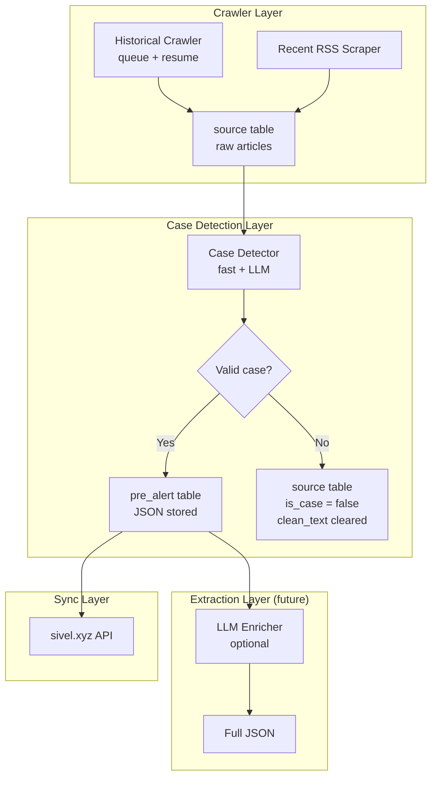

## Description

Implement a unified, modular architecture for the `sivel3agent` that separates concerns and supports scalable ingestion of historical and recent data. This combines the historical crawler (#12) with architectural refactoring (#15) into a single post-MVP effort.

**Why this is needed:**
- The current MVP scraper is a simple script that works for the hackathon but is not maintainable for production.
- Historical data is essential for training and context (#12).
- Classification and extraction are currently mixed, making it hard to debug and improve.
- Different components have different failure modes and should be independently restartable.
- We need a clear distinction between:
  - **Context** (peace processes, arrests, political events) → stored for reference, not pre-alerts
  - **Cases** (victims + violence category) → stored as pre-alerts

**This is a Post-MVP task.** For the hackathon, the existing scraper + extractor will remain.

---

## Core Principles

1. **Separate concerns:** Crawler, classifier, and extractor are independent modules.
2. **Case detection:** A "case" requires (a) victims (individual or collective) and (b) a Noche y Niebla category.
3. **Resumable crawling:** Historical crawler tracks progress and resumes after time limits.
4. **Re-classification:** Classification can be re-run on existing data without re-scraping.
5. **Deduplication:** By URL, content_hash, and (future) semantic similarity.

---

## Architecture



---

## Data Model

### 1. `source` table (raw articles)

```sql
CREATE TABLE source (
    id SERIAL PRIMARY KEY,
    url VARCHAR(500) UNIQUE NOT NULL,
    content_hash VARCHAR(66) UNIQUE,
    clean_text TEXT,                     -- full text (temporary)
    is_case BOOLEAN DEFAULT NULL,        -- NULL = pending, TRUE = case, FALSE = not a case
    is_temporary BOOLEAN DEFAULT TRUE,   -- cleared after classification
    case_reason TEXT,                    -- why it was classified as case or not
    category VARCHAR(50),                -- Noche y Niebla code if applicable
    victim_type VARCHAR(20),             -- 'individual' or 'collective'
    victim_count INTEGER,                -- number of victims
    department VARCHAR(100),
    medium VARCHAR(100),
    title VARCHAR(500),
    published_at TIMESTAMP,
    created_at TIMESTAMP DEFAULT NOW()
);

CREATE INDEX idx_source_is_case ON source(is_case);
CREATE INDEX idx_source_url ON source(url);
CREATE INDEX idx_source_content_hash ON source(content_hash);
CREATE INDEX idx_source_department ON source(department);
```

### 2. `crawler_queue` (job queue)

```sql
CREATE TABLE crawler_queue (
    id SERIAL PRIMARY KEY,
    source_name VARCHAR(100) NOT NULL,
    source_type VARCHAR(20) NOT NULL,
    base_url TEXT NOT NULL,
    config JSONB,
    status VARCHAR(20) DEFAULT 'pending',
    priority INTEGER DEFAULT 0,
    progress JSONB,
    last_run_at TIMESTAMP,
    created_at TIMESTAMP DEFAULT NOW()
);

CREATE INDEX idx_crawler_queue_status ON crawler_queue(status);
CREATE INDEX idx_crawler_queue_priority ON crawler_queue(priority DESC);
```

### 3. `pre_alert` (cases ready for marketplace)

```sql
-- Already exists (#2)
CREATE TABLE pre_alert (
    id SERIAL PRIMARY KEY,
    event_hash VARCHAR(66) UNIQUE NOT NULL,
    json_data JSONB NOT NULL,
    status VARCHAR(20) DEFAULT 'pending',
    source_id INTEGER REFERENCES source(id),
    created_at TIMESTAMP DEFAULT NOW()
);
```

---

## Modules

### 1. Crawler Module (`lib/crawler/`)

**Responsibility:** Fetch articles from sources (RSS, historical archives) and store raw data in `source` table.

```typescript
// lib/crawler/index.ts
export interface CrawlerSource {
  name: string;
  type: 'wordpress' | 'spip' | 'rss' | 'custom';
  baseUrl: string;
  config: Record<string, any>;
}

export interface CrawlerProgress {
  last_month?: string;
  last_page?: number;
  last_offset?: number;
  total_processed: number;
}

// Functions:
// - addJob(source): adds a source to the queue
// - listJobs(): lists all jobs
// - runCrawler(): processes one job (time‑limited)
// - resumeJob(jobId): resumes from saved progress
```

### 2. Case Detector Module (`lib/case-detector/`)

**Responsibility:** Determine if an article is a case (victims + violence category).

```typescript
// lib/case-detector/index.ts
export interface CaseDetectionResult {
  isCase: boolean;
  reason: string;
  category?: string;          // Noche y Niebla code
  victimType?: 'individual' | 'collective';
  victimCount?: number;
  json?: object;              // pre‑alert JSON if valid
}

// Functions:
// - detectCase(article): fast + LLM detection
// - reclassifyAll(): re‑run on all `is_case = NULL` articles
// - getStats(): counts of cases vs non‑cases
```

**Detection logic:**

```typescript
async function detectCase(article: Article): Promise<CaseDetectionResult> {
  // 1. Fast filter: violence + region
  const quick = classifyByKeywords(article.clean_text, article.title);
  if (!quick.relevant) {
    return { isCase: false, reason: 'No violence or region keywords' };
  }

  // 2. LLM extraction
  let json: object;
  try {
    json = await extractPreAlert(article);
  } catch {
    return { isCase: false, reason: 'LLM extraction failed' };
  }

  // 3. Validate: has violence category?
  const hasCategory = json.relatos?.[0]?.actos?.length > 0;
  if (!hasCategory) {
    return { isCase: false, reason: 'No violence category (actos) found' };
  }

  // 4. Validate: has victims?
  const hasIndividual = json.relatos?.[0]?.personas?.length > 0;
  const hasCollective = json.relatos?.[0]?.victimas?.length > 0;
  if (!hasIndividual && !hasCollective) {
    return { isCase: false, reason: 'No victims (individual or collective) found' };
  }

  // 5. Extract metadata
  const category = json.relatos?.[0]?.actos?.[0]?.agresion_particular;
  const victimType = hasIndividual ? 'individual' : 'collective';
  const victimCount = hasIndividual
    ? json.relatos[0].personas.length
    : json.relatos[0].victimas.length;

  return {
    isCase: true,
    reason: 'Valid case detected',
    category,
    victimType,
    victimCount,
    json
  };
}
```

### 3. Extractor Module (`lib/extractor/`)

**Responsibility:** Process cases into full pre‑alerts (future: with LLM enrichment).

```typescript
// lib/extractor/index.ts
// For MVP, this is essentially the same as extractPreAlert.
// Post-MVP, it could include additional enrichment (e.g., adding context, cross-referencing).
```

### 4. Orchestrator Scripts

| Script | Purpose |
|--------|---------|
| `scripts/run-crawler.ts` | Runs crawler jobs from queue (time‑limited) |
| `scripts/run-case-detector.ts` | Detects cases on pending articles |
| `scripts/run-extractor.ts` | Generates pre‑alerts from cases |
| `scripts/run-all.ts` | Runs all three sequentially (for development) |

---

## Cron Configuration (Post-MVP)

```bash
# Crawler: run every 2 hours, stops after 10 minutes
0 */2 * * * cd /path/to/sivel3agent && pnpm tsx scripts/run-crawler.ts

# Case detector: run after crawler completes
30 */2 * * * cd /path/to/sivel3agent && pnpm tsx scripts/run-case-detector.ts

# Extractor: run after case detector
0 */4 * * * cd /path/to/sivel3agent && pnpm tsx scripts/run-extractor.ts

# Cleanup temporary rows (daily)
0 3 * * * cd /path/to/sivel3agent && pnpm tsx scripts/cleanup-temporary.ts
```

---

## Implementation Tasks

### Phase 1: Data Model
- [ ] Add `is_case`, `category`, `victim_type`, `victim_count` to `source` table
- [ ] Create `crawler_queue` table
- [ ] Create indexes

### Phase 2: Crawler Module
- [ ] Move historical crawler logic to `lib/crawler/`
- [ ] Implement queue management (add, list, reset)
- [ ] Implement resume support

### Phase 3: Case Detector Module
- [ ] Create `lib/case-detector/` with `detectCase()` function
- [ ] Integrate fast classifier + LLM extraction
- [ ] Validate victims + category
- [ ] Update `source` table with results

### Phase 4: Orchestration
- [ ] Create independent scripts for each module
- [ ] Update cron jobs
- [ ] Update `AGENTS.md` and `ARCHITECTURE.md`

### Phase 5: Cleanup
- [ ] Remove old monolithic scripts (`scrape-news.ts`, `extract-and-save.ts`)
- [ ] Update imports and references

---

## Acceptance Criteria

- [ ] `source` table has `is_case`, `category`, `victim_type`, `victim_count`
- [ ] `crawler_queue` table exists with progress tracking
- [ ] Historical crawler can be paused and resumed
- [ ] Case detector correctly identifies cases (victims + category)
- [ ] Context articles (no victims or no category) are marked `is_case = false`
- [ ] Relevant articles keep `clean_text`; irrelevant articles clear it
- [ ] All three components can run independently
- [ ] Scripts work with existing database schema

---

## Dependencies

- Requires #2 (`source` table)
- Requires #6 (LLM extraction)
- Requires #4/#9 (RSS scraper)

---

## Related Issues

- Epic: [#36](https://github.com/pasosdeJesus/sivel3/issues/36)
- Predecessors: #12, #6, #4/#9
- Related: #8 (cron), #5 (deduplication)

---

> *"Whatever you do, work at it with all your heart, as working for the Lord, not for human masters."* (Colossians 3:23)
