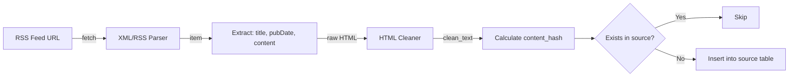

Implement a news scraper that fetches articles from public RSS feeds and APIs for **Colombia and Palestine**. The scraper stores the raw content, cleans it, and saves it to the `source` table (created in #2). For the MVP, the scraper only processes news from **January–June 2026** (a period with no existing cases in sivel2).

**Simplifications for MVP:**
- Only RSS feeds (no complex API integrations)
- Hardcoded list of feeds (no dynamic feed management)
- No incremental fetching (always fetch last N items)
- Manual execution (no cron for MVP; handled by #8)
- Focus on Colombia first (Palestine optional for MVP)

**Post‑MVP:** Add more sources (APIs, web crawling), incremental updates, and proper scheduling.

---

## Data Flow



---

## Source List (MVP)

### Colombia

| Source | URL | Type |
|--------|-----|------|
| INDEPAZ | `https://indepaz.org.co/feed/` | RSS |
| El Tiempo (Justicia) | `https://www.eltiempo.com/justicia/conflicto-y-narcotrafico/feed` | RSS |
| ReliefWeb Colombia | `https://api.reliefweb.int/v1/disasters?profile=list&country[]=CO` | JSON API (optional) |
| HRW Americas | `https://www.hrw.org/feed/feed/rss/americas` | RSS |

### Palestine (optional for MVP)

| Source | URL | Type |
|--------|-----|------|
| Al Jazeera (Palestine) | `https://www.aljazeera.com/xml/rss/palestine.xml` | RSS |
| ReliefWeb oPt | `https://api.reliefweb.int/v1/disasters?profile=list&country[]=PS` | JSON API (optional) |

**For MVP, Colombia feeds are sufficient. Palestine can be added post‑MVP.**

---

## Implementation

### 1. Script location

`apps/nextjs/scripts/scrape-news.ts`

### 2. Dependencies

```bash
pnpm add rss-parser axios node-html-parser
```

### 3. Code

```typescript
// scripts/scrape-news.ts
import Parser from 'rss-parser';
import axios from 'axios';
import { parse as parseHTML } from 'node-html-parser';
import { createHash } from 'crypto';
import { db } from '../lib/db';

const RSS_FEEDS = [
  { url: 'https://indepaz.org.co/feed/', medium: 'INDEPAZ', region: 'Colombia' },
  { url: 'https://www.eltiempo.com/justicia/conflicto-y-narcotrafico/feed', medium: 'El Tiempo', region: 'Colombia' },
  { url: 'https://www.hrw.org/feed/feed/rss/americas', medium: 'HRW', region: 'Colombia' },
];

const START_DATE = new Date('2026-01-01');
const END_DATE = new Date('2026-06-30'); // or new Date() for up to today

interface Article {
  url: string;
  medium: string;
  title: string;
  publishedAt: Date;
  rawContent: string;   // HTML or original content
  cleanText: string;    // Plain text without HTML
  contentHash: string;
}

async function fetchRSSFeed(feedUrl: string): Promise<Article[]> {
  const parser = new Parser();
  const feed = await parser.parseURL(feedUrl);
  
  const articles: Article[] = [];
  
  for (const item of feed.items) {
    const pubDate = item.pubDate ? new Date(item.pubDate) : null;
    
    // Filter by date range (MVP: only 2026)
    if (!pubDate || pubDate < START_DATE || pubDate > END_DATE) {
      continue;
    }
    
    const rawContent = item.content || item.description || '';
    const cleanText = cleanHTML(rawContent);
    const contentHash = createHash('sha256').update(cleanText).digest('hex');
    
    articles.push({
      url: item.link || '',
      medium: feed.title || 'Unknown',
      title: item.title || '',
      publishedAt: pubDate,
      rawContent: rawContent,
      cleanText: cleanText,
      contentHash: contentHash,
    });
  }
  
  return articles;
}

function cleanHTML(html: string): string {
  const root = parseHTML(html);
  // Remove script and style tags
  root.querySelectorAll('script, style').forEach(el => el.remove());
  // Get text content and normalize whitespace
  let text = root.textContent || '';
  text = text.replace(/\s+/g, ' ').trim();
  return text;
}

async function saveArticle(article: Article): Promise<number | null> {
  // Check if already exists by URL or content_hash
  const existing = await db
    .selectFrom('source')
    .select('id')
    .where('url', '=', article.url)
    .orWhere('content_hash', '=', article.contentHash)
    .executeTakeFirst();
  
  if (existing) {
    console.log(`Skipping duplicate: ${article.url}`);
    return null;
  }
  
  const result = await db
    .insertInto('source')
    .values({
      url: article.url,
      medium: article.medium,
      title: article.title,
      published_at: article.publishedAt,
      content_hash: article.contentHash,
      raw_content: article.rawContent,
      clean_text: article.cleanText,
      metadata: JSON.stringify({ region: article.medium === 'Al Jazeera' ? 'Palestine' : 'Colombia' })
    })
    .returning('id')
    .executeTakeFirst();
  
  console.log(`Inserted: ${article.title} (ID: ${result?.id})`);
  return result?.id || null;
}

async function scrapeAllFeeds() {
  console.log(`Starting scrape (${START_DATE.toISOString()} to ${END_DATE.toISOString()})`);
  
  for (const feed of RSS_FEEDS) {
    console.log(`Fetching ${feed.url}...`);
    try {
      const articles = await fetchRSSFeed(feed.url);
      console.log(`Found ${articles.length} articles in date range`);
      
      for (const article of articles) {
        await saveArticle(article);
      }
    } catch (error) {
      console.error(`Error fetching ${feed.url}:`, error);
    }
  }
  
  console.log('Scrape completed.');
}

// Run if called directly
if (require.main === module) {
  scrapeAllFeeds()
    .then(() => process.exit(0))
    .catch((error) => {
      console.error('Fatal error:', error);
      process.exit(1);
    });
}

export { scrapeAllFeeds, fetchRSSFeed, cleanHTML, saveArticle };
```

### 4. Helper script (optional) – test single feed

Create `scripts/test-feed.ts`:

```typescript
import { fetchRSSFeed } from './scrape-news';

async function testFeed(url: string) {
  const articles = await fetchRSSFeed(url);
  console.log(`Found ${articles.length} articles in date range`);
  console.log('First article:', articles[0]);
}

const url = process.argv[2];
if (!url) {
  console.error('Usage: pnpm tsx scripts/test-feed.ts <RSS_URL>');
  process.exit(1);
}
testFeed(url).catch(console.error);
```

---

## Acceptance Criteria (MVP)

- [ ] Scraper fetches articles from at least 2 Colombia RSS feeds.
- [ ] Only articles published between 2026-01-01 and 2026-06-30 are processed.
- [ ] `raw_content` stores the original HTML.
- [ ] `clean_text` stores plain text (no HTML tags).
- [ ] `content_hash` is correctly calculated using `sha256(clean_text)`.
- [ ] Duplicate URLs and duplicate content hashes are rejected (unique constraints on `source` table).
- [ ] The script runs without errors and logs progress.

---

## Dependencies

- Requires #2 (`source` table) to be created first.

---

## Related Issues

- Epic: [#36](https://github.com/pasosdeJesus/sivel3/issues/36)
- Blocks: #6 (LLM integration – needs `source.clean_text`), #7 (generate and send)
- Related: #8 (cron – for future automation)

---

> *"Whatever you do, work at it with all your heart, as working for the Lord, not for human masters."* (Colossians 3:23)

