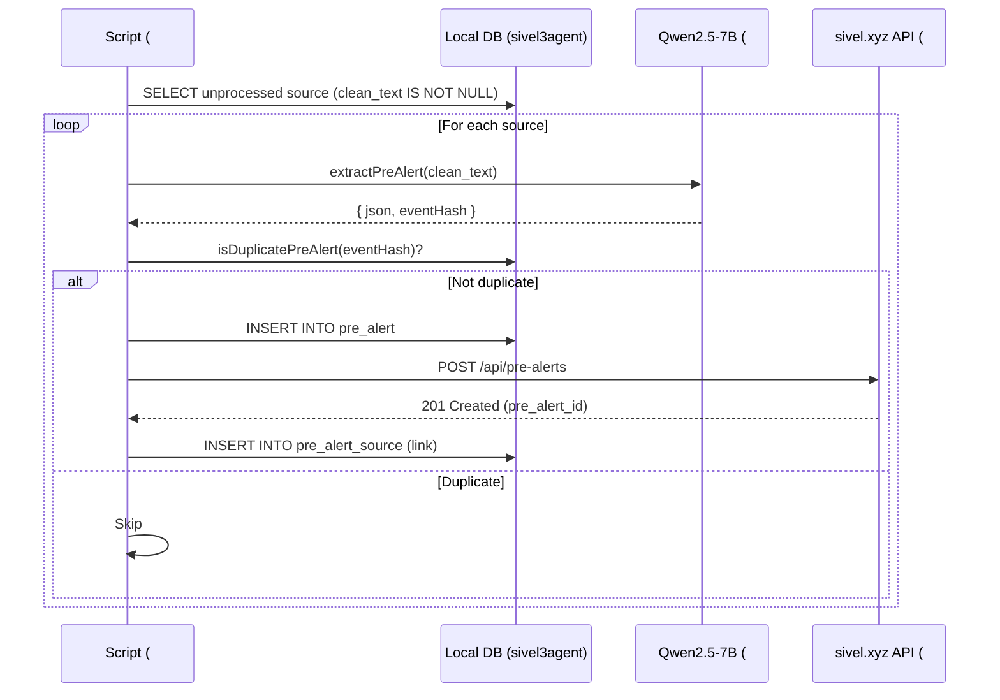

Implement the script that orchestrates the end‑to‑end flow from a source article to a published pre‑alert on `sivel.xyz`. For the MVP, this script:

1. Reads unprocessed sources from the `source` table (populated by #4)
2. Calls the LLM (#6) to extract a pre‑alert JSON
3. Checks for duplicates (#5) using `event_hash`
4. Saves the pre‑alert to the local `pre_alert` table
5. Sends the pre‑alert to `sivel.xyz` via `POST /api/pre-alerts` (#44)

**Note:** Table names are in singular (`source`, `pre_alert`, `pre_alert_source`).

**Simplifications for MVP:**
- Manual execution (no cron, handled by #8 later)
- Direct HTTP call to `sivel.xyz` (no on‑chain publishing for MVP)
- Error handling: log and continue (no retries)
- No `NeedsMoreInfo` or completion logic

**Post‑MVP:** Add on‑chain publishing (`publishPreAlert`), retries, webhook feedback, and cron scheduling.

---

## Data Flow (MVP)



---

## Implementation

### 1. Script location

`apps/nextjs/scripts/generate-and-send.ts`

### 2. Code

```typescript
// scripts/generate-and-send.ts
import { db } from '../lib/db';
import { extractPreAlert } from '../lib/extractPreAlert';
import { isDuplicatePreAlert } from '../lib/duplicate-check';

const SIVEL3_API_URL = process.env.SIVEL3_API_URL || 'https://sivel.xyz/api/pre-alerts';
const SIVEL3_API_KEY = process.env.SIVEL3_API_KEY;

interface PreAlertPayload {
  json_data: object;
  event_hash: string;
  publisher_wallet: string;
  source_urls: string[];
}

async function sendToSivel3(preAlert: PreAlertPayload): Promise<number> {
  const response = await fetch(SIVEL3_API_URL, {
    method: 'POST',
    headers: {
      'Content-Type': 'application/json',
      'X-API-Key': SIVEL3_API_KEY || '',
    },
    body: JSON.stringify(preAlert),
  });
  
  if (!response.ok) {
    const error = await response.text();
    throw new Error(`sivel.xyz returned ${response.status}: ${error}`);
  }
  
  const data = await response.json();
  return data.id; // pre_alert_id assigned by sivel.xyz
}

async function generateAndSend() {
  console.log('[generate-and-send] Starting...');
  
  // Get sources that have clean_text but are not yet linked to any pre_alert
  const sources = await db
    .selectFrom('source')
    .select(['id', 'url', 'title', 'published_at', 'clean_text', 'medium'])
    .leftJoin('pre_alert_source', 'source.id', 'pre_alert_source.source_id')
    .where('pre_alert_source.pre_alert_id', 'is', null)
    .where('clean_text', 'is not', null)
    .limit(10)  // Process in batches to avoid overloading
    .execute();
  
  console.log(`Found ${sources.length} unprocessed sources.`);
  
  for (const source of sources) {
    console.log(`\nProcessing: ${source.title}`);
    
    try {
      // 1. Extract pre-alert using LLM
      const { json, eventHash } = await extractPreAlert({
        title: source.title,
        date: source.published_at?.toISOString().split('T')[0] || '',
        text: source.clean_text,
        sourceUrl: source.url,
        sourceMedium: source.medium || 'Unknown'
      });
      
      // 2. Check for duplicate
      if (await isDuplicatePreAlert(json)) {
        console.log(`  → Duplicate detected (event_hash: ${eventHash}), skipping.`);
        continue;
      }
      
      // 3. Save locally first (optional, but good for backup)
      const localPreAlert = await db
        .insertInto('pre_alert')
        .values({
          event_hash: eventHash,
          json_data: json,
          status: 'pending'
        })
        .returning('id')
        .executeTakeFirst();
      
      console.log(`  → Saved locally with ID: ${localPreAlert!.id}`);
      
      // 4. Send to sivel.xyz
      const sivel3Id = await sendToSivel3({
        json_data: json,
        event_hash: eventHash,
        publisher_wallet: process.env.AGENT_WALLET_ADDRESS || '',
        source_urls: [source.url]
      });
      
      console.log(`  → Sent to sivel.xyz, pre_alert ID: ${sivel3Id}`);
      
      // 5. Link source to pre_alert (local)
      await db
        .insertInto('pre_alert_source')
        .values({
          pre_alert_id: localPreAlert!.id,
          source_id: source.id
        })
        .execute();
      
      // 6. Optionally store the remote ID for reference
      await db
        .updateTable('pre_alert')
        .set({ remote_id: sivel3Id })
        .where('id', '=', localPreAlert!.id)
        .execute();
      
    } catch (error) {
      console.error(`  → Failed: ${error instanceof Error ? error.message : error}`);
      // Continue with next source
    }
  }
  
  console.log('\n[generate-and-send] Finished.');
}

// Run if called directly
if (require.main === module) {
  generateAndSend()
    .then(() => process.exit(0))
    .catch((error) => {
      console.error('Fatal error:', error);
      process.exit(1);
    });
}

export { generateAndSend };
```

### 3. Environment Configuration

Add to `apps/.env`:

```bash
# sivel.xyz API
SIVEL3_API_URL=https://sivel.xyz/api/pre-alerts
SIVEL3_API_KEY=your-secret-api-key
AGENT_WALLET_ADDRESS=0x8C88169977c180f6380C01daAA9c7F31894c20dc
```

### 4. Update `pre_alert` table (add `remote_id` column)

```sql
ALTER TABLE pre_alert ADD COLUMN remote_id INTEGER;
```

---

## Expected Output (Console)

```
[generate-and-send] Starting...
Found 3 unprocessed sources.

Processing: Asesinato de líder social en Puerto Guzmán
  → Saved locally with ID: 42
  → Sent to sivel.xyz, pre_alert ID: 101
  → Source linked.

Processing: Masacre en zona rural de Putumayo
  → Duplicate detected (event_hash: 0x7a8f...), skipping.

Processing: Desplazamiento forzado en Cauca
  → Saved locally with ID: 43
  → Sent to sivel.xyz, pre_alert ID: 102
  → Source linked.

[generate-and-send] Finished.
```

---

## Acceptance Criteria (MVP)

- [ ] Script reads unprocessed sources from `source` table.
- [ ] For each source, calls `extractPreAlert` from #6.
- [ ] Checks duplicate via `isDuplicatePreAlert` from #5.
- [ ] Saves non‑duplicate pre‑alerts to local `pre_alert` table.
- [ ] Sends pre‑alert to `sivel.xyz` via `POST /api/pre-alerts`.
- [ ] Links source to pre‑alert in `pre_alert_source` table.
- [ ] Handles errors gracefully (continues with next source).
- [ ] Script can be run manually via `pnpm tsx scripts/generate-and-send.ts`.

---

## Dependencies

- Requires #2 (`source`, `pre_alert`, `pre_alert_source` tables)
- Requires #4 (scraper populates `source.clean_text`)
- Requires #5 (`isDuplicatePreAlert` function)
- Requires #6 (`extractPreAlert` function)
- Requires #44 (`POST /api/pre-alerts` endpoint in sivel.xyz)

---

## Related Issues

- Epic: [#36](https://github.com/pasosdeJesus/sivel3/issues/36)
- Predecessors: #2, #4, #5, #6
- Blocks: #8 (cron – will call this script periodically)
- Related: #44 (sivel.xyz API endpoint)

---

> *"Whatever you do, work at it with all your heart, as working for the Lord, not for human masters."* (Colossians 3:23)

